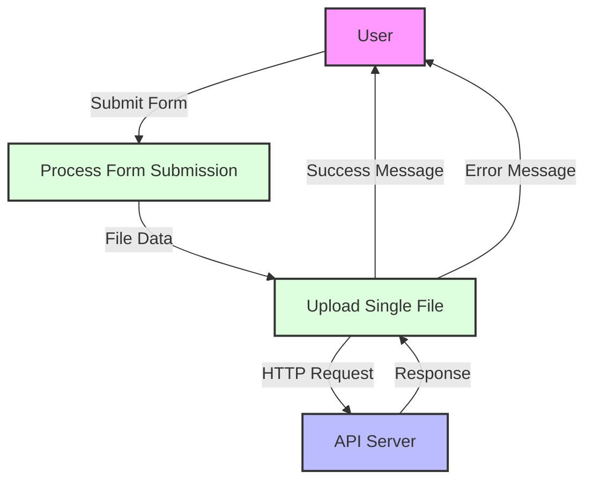

## Module: main.js

# Documentación Técnica: main.js

## 1. **Nombre del módulo o componente SQL:**
main.js - Módulo de carga de archivos para interfaz web

## 2. **Objetivos principales:**
Este módulo gestiona la carga de archivos individuales desde una interfaz web hacia un servidor backend. Su propósito es proporcionar una funcionalidad de carga de archivos con retroalimentación visual para el usuario, manejando tanto los casos de éxito como los errores.

## 3. **Funciones, métodos o consultas críticas:**
- `uploadSingleFile(file)`: Función principal que maneja la carga del archivo mediante XMLHttpRequest.
- Event listener para el evento "submit" del formulario: Captura el envío del formulario y ejecuta la lógica de validación y carga.

## 4. **Variables y elementos clave (columnas, tablas, parámetros):**
- `singleUploadForm`: Referencia al formulario de carga.
- `singleFileUploadInput`: Referencia al campo de entrada de archivo.
- `singleFileUploadError`: Elemento para mostrar mensajes de error.
- `singleFileUploadSuccess`: Elemento para mostrar mensajes de éxito.
- `formData`: Objeto FormData utilizado para enviar el archivo al servidor.

## 5. **Interdependencias y relaciones:**
- Se comunica con el endpoint `/ecommercempadministrador/api/v1/almacenar` mediante una solicitud POST.
- Depende de elementos HTML específicos identificados por IDs (#singleUploadForm, #singleFileUploadInput, etc.).
- Espera una respuesta JSON del servidor que contenga información sobre el resultado de la operación.

## 6. **Operaciones centrales vs. auxiliares:**
- **Centrales**: La función `uploadSingleFile()` y el manejo del evento submit del formulario.
- **Auxiliares**: Manipulación del DOM para mostrar mensajes de éxito o error, validación de la selección de archivo.

## 7. **Secuencia operativa o flujo de ejecución:**
1. El usuario selecciona un archivo y envía el formulario.
2. Se valida que se haya seleccionado un archivo.
3. Se crea un objeto FormData y se adjunta el archivo.
4. Se envía la solicitud AJAX al servidor.
5. Se procesa la respuesta y se muestra el mensaje correspondiente (éxito o error).

## 8. **Aspectos de rendimiento y optimización:**
- Solo permite la carga de un archivo a la vez, lo que limita el uso de ancho de banda.
- No implementa comprobaciones de tamaño de archivo o tipo antes de la carga, lo que podría causar problemas con archivos grandes.
- No muestra una barra de progreso durante la carga, lo que podría mejorar la experiencia del usuario.

## 9. **Reusabilidad y adaptabilidad:**
- El código está acoplado a IDs específicos de elementos HTML, lo que limita su reusabilidad.
- La URL del endpoint está codificada directamente, dificultando su uso en diferentes contextos.
- Podría mejorarse encapsulando la funcionalidad en una clase o módulo más genérico con parámetros configurables.

## 10. **Uso y contexto:**
- Este módulo se utiliza en una interfaz web de administración de un sistema de comercio electrónico.
- Se integra en páginas donde los administradores necesitan cargar archivos (posiblemente imágenes de productos, documentos, etc.).
- Requiere que los elementos HTML correspondientes estén presentes en la página.

## 11. **Supuestos y limitaciones:**
- Supone que el servidor devolverá respuestas en formato JSON.
- No maneja múltiples archivos simultáneamente.
- No implementa validación del tipo de archivo o tamaño en el lado del cliente.
- No muestra el progreso de la carga, lo que puede ser problemático para archivos grandes.
- No maneja errores de red o tiempos de espera explícitamente.
## Flow Diagram [via mermaid]

